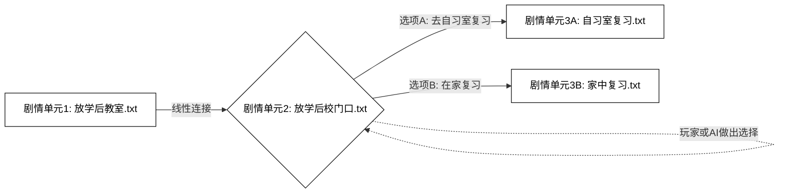
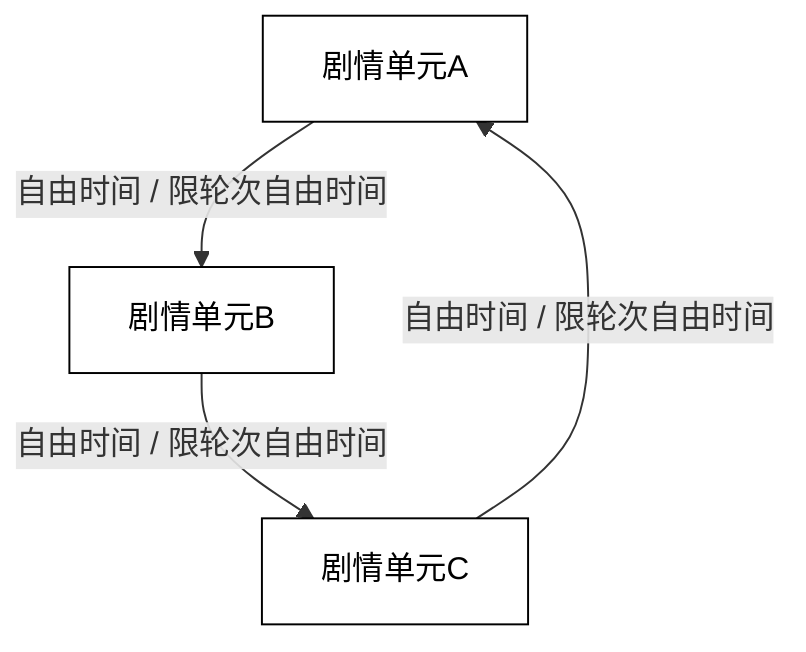
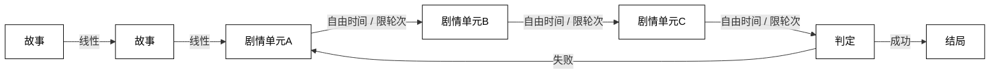

# 一、LingChat 0.4 要做什么？

在LingChat 0.1，我们完成了一个使用仿碧蓝档案UI的，有语音和立绘切换的，和AI聊天的系统。

在LingChat 0.2，我们给系统添加了RAG实现跨越对话的永久记忆，时间感知，以及存档读档功能

在LingChat 0.3，我们完善了各个功能，添加了多人物支持，创意工坊，音乐和背景导入，使得LingChat 可以被深度自定义，并增加了易用性。

至此，一个“使用仿碧蓝档案UI的，有语音和立绘切换的，和AI聊天的系统”已经完善，是时候做一些前人没有做过的东西了。


在LingChat 0.4，我们将会为LingChat添加以下功能。

- **长线剧情系统**：支持使用类似galgame的剧情预设，直接兼容传统galgame的预设剧本和分歧选择，同时支持将一部分甚至全部的剧情**由AI驱动**。你将在剧情内日常的场合，停下来和主角自由的谈心，聊够了在继续剧情；你将不再局限于点击选项来选择剧情分歧，而是真正进入故事，说出你想说的话，影响主角做出重要选择，或者**劝说**主角真正的回心转意。
- **剧本杀/跑团模式**：支持使用类似剧本杀/跑团模式的剧情预设，由一个DM（主持人）来掌控剧情的发展，你将体验到诸如随着时间的推移获得越来越多的信息，判断“谁是凶手”，等类剧情游戏
- **随机事件生成器**：轻量化的剧情引导，如你和你的oc探索地下迷宫的过程中，由LLM生成你们下一个房间的见闻
- **大量的预设小游戏**：和你的一个甚至多个oc人设玩一把狼人杀，真心话大冒险，甚至恶魔轮盘赌等经典互动游戏

这些功能互不冲突需要一个从头开始精心设计的框架，所以这些功能不会逐次更新，而是在不停排查兼容性调优后，设计一个兼容这些所有模式的核心逻辑，讲这些功能**一次性全部实现**。

我们还会编写可视化剧情编辑系统，编写详尽的说明文件，让所有人可以编写出属于自己的，可以参与其中的故事——LingChat 0.4，更接近于一个“剧情编辑器”+“剧情渲染器”，提供一个AI时代的剧情展现平台。

# 二，Yaml结构设计

在LingChat 0.4，我们将定义可导入的剧情包的标准格式，在玩家之间或者创意工坊传播。剧情包将会使用.yaml的格式编写。

## Events

Events是剧情文本。我们把一个剧情文本氛围旁白、角色发言、玩家发言和公告四种类型。同时每种类型都支持`Preset`(预设)模式和`Prompt`(提示词-llm驱动)模式。以下内容将被写入txt或者yaml，作为可导入的剧情包，然后被python解析，用于驱动剧情。

### 旁白

旁白，最基础的剧情演绎方式。在LingChat 0.4中，我们给出预设模式和提示词模式两种选择。

```yaml
Events:
  - "Type: Narration | Mode: Preset": |
      放学了。
  - "Type: Narration | Mode: Preset": |
      夕阳的余晖透过窗户，洒在空无一人的教室里。
```

注意，由于galgame的性质，每次只显示一行文本，每次回车都会到下一行，所以如果想要实现多行文本和旁白描述，应该分成两条`Narration`事件。

```yaml
Events:
  - "Type: Narration | Mode: Prompt": |
      你是一个负责剧情衔接的旁白。请参考上述剧情，描述{player_name}看着{AI_character_1}转身离去的背影，在{time}的夜色下，心中涌起的一丝莫名的失落与怅然。三行左右，每行20字。
```

对提示词模式生成的多行文本，也应遵守galgame的“单行渲染，回车换行”原则。

### 角色发言

角色发言，是galgame的核心剧情演绎方式。同样的，我们给出预设模式和提示词模式两种选择，并且考虑到多个预设角色的兼容性。

```yaml
Events:
  - "Type: Dialogue | Character: {AI_character_1} | Mode: Preset": |
      早上好啊，{player_name}~今天又是没有干劲的一天呐
```

注意，在向llm发送角色对话请求时，应该区分每个AI角色，每个AI角色都应该启用对应角色的提示词，并且请求时，把该角色的预设/生成的对话记录放入`assistant_output`，而其他AI角色应该放入`user_input`并在开头增加`角色B:xxxx`

```yaml
Events:
  - "Type: Dialogue | Character: {AI_character_2} | Mode: Prompt": |
      这是你的内心活动：你准备向{player_name}求助，所以你应该讨好{player_name}
```

### 玩家发言

作为galgame，玩家有被剧情固定的强制发言当然很合理，剧情杀嘛。

```yaml
Events:
  - "Type: Player | Mode: Preset": |
      我不想学习！
```

当然，最核心的是，可以让玩家打字输入，直接和剧情交互，存入整个对话记录中，影响后续llm扮演其他角色的发言。

```yaml
Events:
  - "Type: Player | Mode: Input": |
```

在演进到这个阶段的时候，代码将会等待玩家输入，然后敲回车键发送。

```yaml
Events:
  - "Type: Player | Mode: Input": |
      我们走吧~
```

考虑到有时候我们需要提示一下玩家，给个参考，他现在大概需要说什么，这个type也可以添加`Content`。

### 公告

有时候我们需要多行文本以增加玩家可读性。所以我们定义`Notice`。

```yaml
Events:
  - "Type: Notice | Mode: Preset | Location: popup": |
      这是LingChat狼人杀模式。
      游戏规则是：xxxxxxx
      玩得开心！
  - "Type: Notice | Mode: Prompt | Location: message": |
      你是一个剧本杀的DM（主持人），请根据以上聊天内容情况，播报昨晚的情况。
```

`Notice`是多行的，并且通常不在对话框内渲染，他可能是弹窗的，也可能显示在某个背景位置。在这里，我们使用location来区分Notice的种类，定义Notice出现的位置，与前端进行交互。

### 章节

考虑到Events直接指导生成聊天记录，我们把分章节的功能写入Events，在演进到Events:Type: Chapter时，在聊天记录存档内注入“章节”的标记，以便于前端的分章节渲染。

```yaml
Events:
  - "Type: Chapter | Mode: Preset":
      Title: "第一章：放学后的邂逅"
      Number: 1 
      Description: "夕阳下的校门口，一个寻常却又注定不凡的下午，故事就此展开。"
```

### 隐性条件

使用`Type: Action`在`gamestate.yaml`里操作、记录、储存变量，在prompt使用{变量名}调用这个变量。

例如，在某个选择正确的支线，你可以插入一个Action：

```yaml
Events:
- "Type: Action | Tool: Calculate | Variable: favorability_AI_character_1":
      Expression: "{favorability_AI_character_1} + 10"
```

然后你可以在prompt里写：

```yaml
Events:
  - "Type: Dialogue | Character: {AI_character_2} | Mode: Prompt": |
      这是你的内心活动：听到{player_name}向你表白，考虑到你对他现在的好感度是{favorability_AI_character_1}(最低为-100，最高为100)，你决定如何回答他呢？
```

当然，也可以随机变量，比如这样写：

```yaml
Events:
  - "Type: Action | Tool: Random | Variable: dice_roll":
      Min: 1
      Max: 20
```

或者随机字符串：

```yaml
Events:
  - "Type: Action | Tool: RandomChoice | Variable: shotgun_status":
      Choices:
        - "霰弹枪里有子弹"
        - "霰弹枪里子弹受潮了，可能会卡壳"
        - "霰弹枪里没有子弹"
        - "枪膛是空的，但你摸到口袋里还有一颗备用弹"
```

当然，布尔值也行。

```yaml
Events:
  - "Type: Narration | Mode: Preset": |
      你在一个生锈的盒子底下找到了地下室的钥匙！
  - "Type: Action | Tool: Set | Variable: has_basement_key":
      Value: true
```

在第一次操作的时候会自动在`gamestate.yaml`创建这个变量，后续操作会直接覆盖这个变量。如果你单纯想初始化系统，或者强行设置一个，你可以：

```yaml
Events:
  - "Type: Action | Tool: Random | Variable: dice_roll":
      Min: 1
      Max: 1
```

或者

```yaml
Events:
  - "Type: Action | Tool: RandomChoice | Variable: shotgun_status":
      Choices:
        - "霰弹枪被装入了子弹"
```

当你的gamestate.yaml内部储存了信息，在写prompt时，会把当前状态传入prompt。

这样的话，你可以设定某些对话只在高好感的时候触发，比如高好感下会有彩蛋表白对话，或者实现逻辑判断。影响剧情对话很好写，比如这样写：

```yaml
Events:
  - "Type: Dialogue | Character: {AI_character_2} | Mode: Prompt": |
      这是你的内心活动：听到{player_name}向你表白，考虑到你对他现在的好感度是{favorability_AI_character_1}(最低为-100，最高为100)，你决定如何回答他呢？
```

复杂的写就可以这样写：

```yaml
Events:
  - "Type: Action | Tool: Random | Variable: dice_roll":
      Min: 1
      Max: 20

  - Condition: "{dice_roll} == 20"
    Events:
      - "Type: Narration | Mode: Preset": |
          骰子在桌面上飞速旋转，最终停在了“20”！大成功！
      - "Type: Narration | Mode: Preset": |
          你感觉一股神秘的力量涌入体内！
      - "Type: Action | Tool: Calculate | Variable: player_power":
          Expression: "{player_power} + 5"

  - Condition: "{dice_roll} > 1 && {dice_roll} < 20"
    Events:
      - "Type: Narration | Mode: Preset": |
          骰子停了下来，点数是 {dice_roll}。

  - Condition: "{dice_roll} == 1" # 大失败
    Events:
      - "Type: Narration | Mode: Preset": |
          糟糕！骰子竟然投出了“1”！大失败！
      - "Type: Narration | Mode: Preset": |
          你脚下一滑，摔了个四脚朝天。
      - "Type: Action | Tool: Calculate | Variable: player_hp":
          Expression: "{player_hp} - 1"

  - Condition: "{has_basement_key} == true"
    Events:
      - "Type: Narration | Mode: Prompt": |
          你现在拥有地下室的钥匙，请生成一段你尝试用钥匙打开地下室门的旁白。
```

## EndCondition

我们会将大量的Events对话封装成一个.yaml文件，称之为“剧情单元”。那么每个剧情单元之间互相连接就可以实现多结局的剧情设计。



如该图，这样连接就实现了剧情分歧。那么现在，我们开始定义EndCondition，即在每个剧情单元结尾，如何与后续剧情连接。

### 线性连接(`Linear`)

最基础的线性连接，当一个剧情单元的.yaml文件的Events播放完毕后，使用`Linear`即可连接下一个.yaml剧情单元，无缝的继续剧情。

```yaml
EndCondition:
  Type: Linear
  NextUnitID: SchoolGate_02
```

线性连接无缝无感，是后续实现复杂的呈现效果，就可以用多个特殊的线性连接来衔接呈现。

### 自由时间 (`FreeTime`)

谁能拒绝在决战前夕停下来和主角自由聊天，加油打气呢。

```yaml
EndCondition:
  Type: FreeTime
  InstructionToPlayer: "你已进入自由聊天时间。点击右上方按钮，或输入包含“我已经准备好了”的句子可结束自由聊天对话。"
  ExitPromptInInputBox: "我已经准备好了"
  NextUnitID: ForestPath_05
```

这样就可以让玩家可以在特定场景下与AI自由对话，直到触发结束语。

### 限定轮次自由时间 (`LimitedFreeTime`)

当然，有时候决战前时间紧迫，不可能悠哉悠哉的永远聊下去。

```yaml
EndCondition:
  Type: LimitedFreeTime
  MaxTurns: 3 # 定义玩家与AI角色交互的最大轮次。
  InstructionToPlayer: "你已进入限时自由聊天时间。你最多可以和{AI_character_3}聊{MaxTurns} 轮。点击右上方按钮或输入包含“我已经准备好了”的句子可提前结束。"
  ExitPromptInInputBox: "我已经准备好了"
  NextUnitID: ForestPath_05
```

这样就可以设置最大聊天轮次。

### 分支结局 (`Branching`)

让剧情根据玩家的选择或AI的决定走向不同的道路。

对于经典的galgame呈现方式，即`Method: PlayerChoice`，给定选项使玩家选择，当然要有。

```yaml
EndCondition:
  Type: Branching
  Method: PlayerChoice
  Branches:
    A: 
      DisplayText: "上前打个招呼"
      NextUnitID: Park_Encounter_05A
    B: 
      DisplayText: "还是不要打扰她了，悄悄离开"
      NextUnitID: GoHome_Quietly_05B
    C: 
      DisplayText: "装作没看见从她前面经过"
      NextUnitID: Park_Encounter_05B
    ...
```

把选择权留给AI主角也不错。

```yaml
EndCondition:
  Type: Branching
  Method: AIChoice
  # 会AI根据这个Prompt，说出自己的决定 (玩家不可见)
  DecisionPromptForAI: "这是你的内心活动：现在是时候做出决定了。综合刚才和{player_name}的对话，以及他对你邀请的回应，明确告诉他，你最终决定'一起去自习室'还是'先各自回家'复习。"

  # 系统后台根据AI说的话，进行判断 (玩家不可见)
  JudgePromptForSystem: |
    你是AI-galgame的剧情助手。请根据聊天记录，判断{AI_character_3}是打算 A:去自习室学习 还是 B:在家学习。
    你只能输出'A'或'B'，无需任何其他解释。
    
  # 3. 根据判断结果(A或B)，跳转到不同剧情
  Branches:
    A: Library_03A
    B: GoHome_03B
```

做出选择之后将会直接跳到下一个剧情单元。如果你想要有旁白或者什么提示来提示说明你的选择和你的剧情线，那就在连接的下一个剧情单元的开头写notice或者旁白。

### 条件结局(`Conditional `)

有了隐式变量，自然可以做出通过存档保存的隐式变量来决定结局。

```yaml
EndCondition:
  Type: Conditional
  # Cases会按顺序检查，遇到第一个为True的Condition即执行，然后结束
  Cases:
    - Condition: "{favorability_AI_character_1} >= 80 && {has_love_letter} == true"
      Then:
        Type: Linear
        NextUnitID: Confession_Success_10A

    - Condition: "{favorability_AI_character_1} >= 50"
      Then:
        Type: FreeTime
        InstructionToPlayer: "她看起来对你很有好感，似乎想和你多聊一会儿。输入“再见”结束对话。"
        ExitPromptInInputBox: "再见"
        NextUnitID: FriendZone_Date_10B
        
  # 如果以上所有Cases的Condition都为False，则执行Else中的结局
  Else:
    Type: Linear
    NextUnitID: Normal_Ending_10C
```


## SceneConfig

定义单个剧情单元内的全局变量，用于与其他模块通信等，如让前端知道在这个场景下该用什么背景图片

```yaml
SceneConfig:
  id: "SchoolGate_01"
  name: "放学后的校门口"
  description: "夕阳下的校门口，学生们陆续离去，一切都显得那么平静而美好。"
  tags: ["school", "slice-of-life", "evening"]
  
  visuals:
    background_image: "bg_school_gate_sunset.png"
  audio:
    background_music: "bgm_school_farewell.mp3"
    music_volume: 0.7
```

## 剧情单元示意

最后，一个完整的yaml剧情单元差不多会长这个样子：

```yaml
SceneConfig:
  id: "Classroom_01"
  name: "放学后"
  description: "夕阳下教室，一切都显得那么平静而美好。会有什么故事发生呢？"
  tags: ["school", "slice-of-life", "evening"]
  
  visuals:
    background_image: "bg_school_classroom_sunset.png"
  audio:
    background_music: "bgm_school_farewell.mp3"
    music_volume: 0.7
    
Events:
  - "Type: Chapter | Mode: Preset":
      Title: "第一章：放学后的邂逅"
      Number: 1 
      Description: "夕阳下的教室，一个寻常却又注定不凡的下午，故事就此展开。"
  - "Type: Narration | Mode: Preset": |
      放学了。
  - "Type: Narration | Mode: Preset": |
      夕阳的余晖透过窗户，洒在空无一人的教室里。
  - "Type: Narration | Mode: Preset": |
      只剩下我和{AI_character_1}两个人还在慢吞吞地收拾着书包。
  - "Type: Dialogue | Character: {AI_character_1} | Mode: Preset": |
      呼...终于弄完了。今天值日还真是有点累呢。
  - "Type: Player | Mode: Input": |
  - "Type: Dialogue | Character: {AI_character_2} | Mode: Prompt": |
      这是你的内心活动：听了{player_name}的回应，你感觉心情放松了一些。但一想到下周就要考试了，又感到一阵焦虑。你打算聊些考试的话题。
  - "Type: Player | Mode: Input": |

EndCondition:
  Type: FreeTime
  InstructionToPlayer: "你已进入自由聊天时间。点击右上方按钮，或输入包含“我们走吧”的句子可结束自由聊天对话。"
  ExitPromptInInputBox: "我们走吧"
  NextUnitID: SchoolGate_01
```

## 隐性条件示意

我们需要一个区域储存隐性的游戏状态，如：

- 当前角色对主角的好感度
- 这次恶魔轮盘赌中，枪里有没有子弹

我们将其储存在`gamestate.yaml`中，在剧本的初始就应该给出初始`gamestate.yaml`。

```yaml
# gamestate.yaml
player_name: "Sensei"
current_time: "黄昏"

# 角色好感度
favorability_AI_character_1: 25
favorability_AI_character_2: 60

# 剧情标志 (Flags)
has_basement_key: false
completed_prologue: true
is_rival_angry: false

# 资源/数值
player_hp: 100
gold: 500
dice_roll_result: 15
shotgun_status: "枪膛是空的，但你摸到口袋里还有一颗备用弹"
```

# 三，多yaml连接

为代码的可维护性，我们希望在各种模式下都使用同一套逻辑系统。如想启动正常的自由对话模式，可以载入一个无任何预设，自由时间结局并与自己连接的yaml剧本即可。在Yaml结构设计部分，我们讨论了如何设计以推进AI-galgame，下面我们讨论其他场景下的剧本预设方法。

## 循环链接

yaml之间可以首位相接组成循环，这样就能产生无尽的剧本。

如果你想写一个探索地下迷宫的无尽剧情，你可以这样设计：



将多个剧情单元首尾相接，在剧情单元的开头写上：

```yaml
Events:
  - "Type: Narration | Mode: Prompt": |
      你是负责推进剧情的AI助手，请根据前面所有的历史对话，创建他们进入的下一个迷宫会看到的场景，用旁白的语言描述出来。
```

这样就可以无限创建新的迷宫用来探索。

当然，对于一个断案剧本来说，可以这样设计：



将简单的剧情单元依次链接，就可以完成复杂的剧本任务。

# 四，储存结构与存档

## 储存结构

```
剧本文件/
├── save/
│   └── gamestate.yaml
├── character/        #可导入外部玩家oc对应每个“角色位置”，也可直接包含在剧本包。建议使用默认+覆盖的结构
│   ├── AI角色A.yaml
│   ├── AI角色B.yaml
│   ...
│   └── 玩家人设.yaml
├── story/
│   ├── 剧情_01.yaml
│   ├── 剧情_02.yaml
│   ...
│   └── 剧情_结局.yaml
├── 全局剧情配置.yaml
└── 剧情介绍.md
```

当游戏开始时，依照剧情包生成一个存档文件，里面包含一个完整的剧情定义和实现；然后通过记录剧本演进状态来实现存档和读档，这样兼容普通对话，galgame剧情，狼人杀剧情等所有剧情，区别只是加载哪个剧情包

```
存档文件/              #一个对话开始时，从剧本文件和角色文件生成一个存档文件，包含一个逻辑完整的，可直接运作的人设和剧本，支持存档和读档
├── save/
│   ├── 游戏进度.yaml
│   ├── gamestate.yaml
│   └── 对话记录.yaml
├── character/
│   ├── AI角色A.yaml
│   ├── AI角色B.yaml
│   ...
│   └── 玩家人设.yaml
├── story/
│   ├── 剧情_01.yaml
│   ├── 剧情_02.yaml
│   ...
│   └── 剧情_结局.yaml
├── 全局剧情配置.yaml
└── 剧情介绍.yaml
```

注意，剧情yaml和角色yaml是分离的，角色yaml是可以换成用户自己喜欢的oc的，所以在编写prompt的时候，编写原则是，只能编写背景Prompt，不能混入人物prompt。

## 读档存档

使用每次事件都会更新的游戏进度.yaml来保存和读取游戏存档。

```yaml
# 游戏进度.yaml
# 描述了游戏的核心进度和当前所处的状态。

# --- 元数据 ---
save_name: "初遇后的傍晚"
story_pack_id: "lingchat-sunset-promise-v1" # 用于校验和创意工坊识别
last_saved_timestamp: "2023-10-27T18:30:05Z"

# --- 核心进度指针 ---
# 精确指向最后完成的事件位置。
progress_pointer:
  # 当前所在的剧情单元ID，对应 story/ 目录下的文件名（不含.yaml）
  current_unit_id: "Classroom_01" 
  
  # 最后*已完成*的事件在当前剧情单元Events列表中的索引（0-based）。
  # -1 表示该单元刚开始，还未执行任何事件。
  # 加载时，系统将从 last_completed_event_index + 1 开始执行。
  last_completed_event_index: 5 

# --- 运行时状态 ---
# 描述游戏引擎在加载此存档后应该做什么。这是避免bug的关键。
# 可能的值:
#  - ExecutingEvents: 正常按顺序执行Events列表。
#  - WaitingForPlayerInput: 暂停，等待玩家输入文本。(对应 Type: Player | Mode: Input)
#  - InFreeTime: 处于自由对话模式，等待玩家输入或触发退出语。
#  - WaitingForPlayerChoice: 暂停，向玩家显示分支选项并等待选择。(对应 EndCondition: Branching | Method: PlayerChoice)
#  - ProcessingAIChoice: 系统后台正在运行AI决策，前端等待结果。(对应 EndCondition: Branching | Method: AIChoice)
runtime_state: "WaitingForPlayerInput"
```

在处于自由对话的时候，硬做特殊兼容性处理。

```yaml
# 游戏进度.yaml

# --- 元数据 ---
save_name: "和由纪的课后闲聊"
story_pack_id: "lingchat-yuki-afterschool-v1.0"
last_saved_timestamp: "2023-10-28T16:45:10Z"

# --- 核心进度指针 ---
# 精确指向最后完成的事件位置。
progress_pointer:
  # 当前所在的剧情单元是 Classroom_AfterSchool_01
  current_unit_id: "Classroom_AfterSchool_01" 
  
  # 该剧情单元中所有预设的Events都已执行完毕。
  # 假设该单元有4个预设事件 (索引 0, 1, 2, 3)，那么最后一个完成的索引是3。
  # 系统已进入EndCondition阶段。
  last_completed_event_index: 3 

# --- 运行时状态 ---
# 这是最关键的部分，它告诉系统读档后该做什么。
# "InFreeTime" 明确指示引擎：不要再去执行Events列表，而是激活自由聊天/限时自由聊天的逻辑。
runtime_state: "InFreeTime"

# --- 状态特定数据  ---
# 由于 runtime_state 是 "InFreeTime"，且原始 EndCondition 是 LimitedFreeTime，
# 系统会记录并恢复这个上下文信息。
limited_free_time_context:
  # 已经完成的对话轮次（1轮 = 玩家说1句 + AI说1句）。
  turns_taken: 1
  # 从 EndCondition 中读取的总轮次限制，方便恢复时直接使用。
  max_turns: 3
```


## 对话记录

对话记录是RAG系统运转和LLM运转的核心，很多工作将会基于对话记录进行。

```yaml
# 对话记录.yaml
# 记录了所有已发生的对话、旁白等。

# --- 预设剧情事件的记录 ---
- id: "evt_001"
  timestamp: "2023-10-28T16:40:01Z"
  source_unit_id: "Classroom_AfterSchool_01"
  source_event_index: 0 # 对应Events列表的第0个事件
  type: "Narration"
  content: "夕阳的余晖透过窗户，洒在空无一人的教室里。"

- id: "evt_002"
  timestamp: "2023-10-28T16:40:15Z"
  source_unit_id: "Classroom_AfterSchool_01"
  source_event_index: 1 # 对应Events列表的第1个事件
  type: "Narration"
  content: "只剩下我和月见两个人还在慢吞吞地收拾着书包。"

- id: "evt_003"
  timestamp: "2023-10-28T16:40:40Z"
  source_unit_id: "Classroom_AfterSchool_01"
  source_event_index: 2 # 对应Events列表的第2个事件
  type: "Dialogue"
  character_id: "AI_character_1" # 由纪
  content: "呼...终于弄完了。今天值日还真是有点累呢。"

- id: "evt_004"
  timestamp: "2023-10-28T16:41:20Z"
  source_unit_id: "Classroom_AfterSchool_01"
  source_event_index: 3 # 对应Events列表的第3个事件
  type: "Player"
  content: "是啊，辛苦了。" # 玩家的输入

# --- EndCondition触发，进入自由聊天后的记录 ---

- id: "evt_005"
  timestamp: "2023-10-28T16:41:25Z"
  source_unit_id: "Classroom_AfterSchool_01"
  # source_event_index 为 null，表示这不是来自预设Events列表，而是由系统（如EndCondition）生成的。
  source_event_index: null 
  type: "Notice"
  data:
    location: "popup" # 假设这是弹窗提示
    content: "你已进入限时自由聊天时间。你最多可以和由纪聊3轮。点击右上方按钮或输入包含“我们走吧”的句子可提前结束。"

# --- 第一轮自由对话 ---
- id: "evt_006"
  timestamp: "2023-10-28T16:43:00Z"
  source_unit_id: "Classroom_AfterSchool_01"
  # index同样为null，表示是自由生成的玩家输入
  source_event_index: null
  type: "Player"
  content: "说起来，下周的考试你准备得怎么样了？"

- id: "evt_007"
  timestamp: "2023-10-28T16:44:12Z"
  source_unit_id: "Classroom_AfterSchool_01"
  # index同样为null，表示是自由生成的AI对话
  source_event_index: null
  type: "Dialogue"
  character_id: "AI_character_1" # 月见
  content: "嗯...还行吧，就是数学有点头疼。你呢？"

# --- 游戏在此刻被保存 ---
# 后续的对话（玩家的第二轮输入和AI的回复）尚未发生，因此不会出现在记录中。
```

章节事件会载入到对话记录，便于前端分章节显示聊天记录。

如果剧本这样写：

```yaml
Events:
  - "Type: Narration | Mode: Preset": |
      天空是灰色的，雨丝连绵不绝。
  - "Type: Player | Mode: Input": |
      （玩家输入“这是哪里……”）
  # 章节事件
  - "Type: Chapter | Mode: Preset":
      Title: "第一章：苏醒"
      Number: 1
      Description: "在陌生的房间中醒来，记忆一片空白。"
  - "Type: Narration | Mode: Preset": |
      你缓缓睁开眼睛，发现自己正躺在一张柔软的床上。
```

那么对应的对话记录储存是这样的：

```yaml
# 对话记录.yaml
# --- 序章内容 (在第一个章节标记前) ---
- id: "evt_001"
  timestamp: "2023-10-28T10:00:05Z"
  source_unit_id: "剧情_01"
  source_event_index: 0
  type: "Narration"
  content: "天空是灰色的，雨丝连绵不绝。"

- id: "evt_002"
  timestamp: "2023-10-28T10:00:20Z"
  source_unit_id: "剧情_01"
  source_event_index: 1
  type: "Player"
  content: "这是哪里……"

# --- 章节标记事件 ---
- id: "evt_003"
  timestamp: "2023-10-28T10:00:21Z"
  source_unit_id: "剧情_01"
  source_event_index: 2
  type: "Chapter"  # <--- 关键类型
  # data 字段包含了所有结构化信息，供前端使用
  data:
    title: "第一章：苏醒"
    number: 1
    description: "在陌生的房间中醒来，记忆一片空白。"

# --- 第一章开始后的内容 ---
- id: "evt_004"
  timestamp: "2023-10-28T10:00:30Z"
  source_unit_id: "剧情_01"
  source_event_index: 3
  type: "Narration"
  content: "你缓缓睁开眼睛，发现自己正躺在一张柔软的床上。"

- id: "evt_005"
  timestamp: "2023-10-28T10:01:00Z"
  source_unit_id: "剧情_01"
  source_event_index: 4 # 假设这是下一个事件
  type: "Dialogue"
  character_id: "AI_character_1"
  content: "你醒了？感觉怎么样？"
```


请根据这个架构设计，编写一个狼人杀应用。
```
# logger.py
import logging
import sys
import time
import threading
from datetime import datetime
import os
import re  # Import re for ANSI stripping

# 日志配置
ENABLE_FILE_LOGGING = True  # 是否启用文件日志记录
LOG_FILE_DIRECTORY = "run_logs"  # 日志文件存储的相对目录

# 注意，若环境变量DEBUG_MODE = True/false时，会覆盖LOG_FILE_LEVEL的设置
LOG_FILE_LEVEL = logging.DEBUG  # 可以设置为 logging.DEBUG，logging.INFO, logging.WARNING, logging.ERROR

ANIMATION_STYLES = {
    'braille': ['⢿', '⣻', '⣽', '⣾', '⣷', '⣯', '⣟', '⡿'],
    'spinner': ['-', '\\', '|', '/'],
    'dots': ['.  ', '.. ', '...', ' ..', '  .', '   '],
    'arrows': ['←', '↖', '↑', '↗', '→', '↘', '↓', '↙'],
    'moon': ['🌑', '🌒', '🌓', '🌔', '🌕', '🌖', '🌗', '🌘'],
    'clock': ['🕛', '🕐', '🕑', '🕒', '🕓', '🕔', '🕕', '🕖', '🕗', '🕘', '🕙', '🕚'],
    'directional_arrows_unicode': ['⬆️', '↗️', '➡️', '↘️', '⬇️', '↙️', '⬅️', '↖️'],
    'traffic_lights': ['🔴', '🟡', '🟢'],
    'growth_emoji': ['🌱', '🌿', '🌳'],
    'weather_icons': ['☀️', '☁️', '🌧️', '⚡️'],
    'heartbeat': ['♡', '♥'],
}

_ansi_escape_regex = re.compile(r'\x1B(?:[@-Z\\-_]|\[[0-?]*[ -/]*[@-~])')

def _strip_ansi_codes(text):
    """Removes ANSI escape codes from a string."""
    return _ansi_escape_regex.sub('', text)

sys.stderr.flush()

def wcswidth(s):
    """回退 wcswidth, 将非 ASCII 字符视为宽度2。应在剥离ANSI码后使用。"""
    if not isinstance(s, str):
        return len(s) if s else 0
    length = 0
    for char_ in s:  # Assumes s is already stripped of ANSI codes
        if ord(char_) < 128:
            length += 1
        else:
            length += 2
    return length

class TermColors:
    GREY = '\033[90m'
    GREEN = '\033[92m'
    YELLOW = '\033[93m'
    RED = '\033[91m'
    BLUE = '\033[94m'
    RESET = '\033[0m'
    WHITE = '\033[97m'
    CYAN = '\033[96m'
    MAGENTA = '\033[95m'
    LIGHT_BLUE = '\033[94m'  # Actually same as BLUE in this list, but kept for intent
    ORANGE = '\033[38;5;208m'

_logger = None
_animation_thread = None
_stop_animation_event = threading.Event()

_is_animating = False
_current_animation_line_width = 0
_animation_state_lock = threading.Lock()

DEFAULT_ANIMATION_STYLE_KEY = 'braille'
DEFAULT_ANIMATION_COLOR = TermColors.WHITE  # Default color for animation if not specified

class AnimationAwareStreamHandler(logging.StreamHandler):
    def emit(self, record):
        global _is_animating, _current_animation_line_width, _animation_state_lock

        if hasattr(record, 'is_animation_control') and record.is_animation_control:
            super().emit(record)
            return

        current_animation_active_locally = False
        current_width_to_clear_locally = 0

        with _animation_state_lock:
            current_animation_active_locally = _is_animating
            current_width_to_clear_locally = _current_animation_line_width

        if current_animation_active_locally and current_width_to_clear_locally > 0:
            self.acquire()
            try:
                self.flush()
                # Ensure the full line is cleared, then cursor to start
                self.stream.write("\r" + " " * current_width_to_clear_locally + "\r")
                self.stream.flush()
            finally:
                self.release()

        super().emit(record)

class ColoredFormatter(logging.Formatter):
    DATE_FORMAT = "%Y-%m-%d-%H:%M:%S"

    def __init__(self, show_timestamp=True):
        super().__init__(datefmt=self.DATE_FORMAT)
        self.show_timestamp = show_timestamp

    def format(self, record):
        if hasattr(record, 'is_animation_control') and record.is_animation_control:
            return record.getMessage()

        timestamp_part = ""
        if self.show_timestamp:
            timestamp_str = self.formatTime(record, self.DATE_FORMAT)
            timestamp_part = f"{timestamp_str} "

        message_content = record.getMessage()
        level_name = record.levelname
        level_prefix_text = f"[{level_name}]: "

        if record.levelno == logging.DEBUG:
            return f"{TermColors.GREY}{timestamp_part}{level_prefix_text}{message_content}{TermColors.RESET}"

        level_color = ""
        if record.levelno == logging.INFO:
            level_color = TermColors.GREEN
        elif record.levelno == logging.WARNING:
            level_color = TermColors.YELLOW
        elif record.levelno == logging.ERROR:
            level_color = TermColors.RED

        colored_level_prefix = f"{level_color}{level_prefix_text}{TermColors.RESET}"
        return f"{timestamp_part}{colored_level_prefix}{message_content}"


def _animate(message="Loading", animation_chars=None, color_code=DEFAULT_ANIMATION_COLOR):
    global _is_animating, _current_animation_line_width, _animation_state_lock, _stop_animation_event

    if animation_chars is None:
        animation_chars = ANIMATION_STYLES[DEFAULT_ANIMATION_STYLE_KEY]

    idx = 0
    last_char_for_clear = animation_chars[0]

    while not _stop_animation_event.is_set():
        char = animation_chars[idx % len(animation_chars)]
        last_char_for_clear = char

        full_animation_line_with_ansi = f"{color_code}{message} {char}{TermColors.RESET} "

        stripped_line_for_width = _strip_ansi_codes(full_animation_line_with_ansi)
        current_visible_width = wcswidth(stripped_line_for_width)

        with _animation_state_lock:
            _current_animation_line_width = current_visible_width

        sys.stdout.write(f"\r{full_animation_line_with_ansi}")
        sys.stdout.flush()

        idx += 1
        time.sleep(0.12)

    final_animation_line_to_clear_ansi = f"{color_code}{message} {last_char_for_clear}{TermColors.RESET} "
    stripped_final_line = _strip_ansi_codes(final_animation_line_to_clear_ansi)
    width_to_clear = wcswidth(stripped_final_line)

    sys.stdout.write("\r" + " " * width_to_clear + "\r")
    sys.stdout.flush()

    with _animation_state_lock:
        _is_animating = False
        _current_animation_line_width = 0


def start_loading_animation(message="Processing",
                            animation_style_key=DEFAULT_ANIMATION_STYLE_KEY,
                            animation_color=DEFAULT_ANIMATION_COLOR):
    global _animation_thread, _stop_animation_event, _is_animating, _current_animation_line_width, _animation_state_lock

    with _animation_state_lock:
        if _is_animating:
            log_debug("Animation already running, not starting another one.")
            return

        _stop_animation_event.clear()
        selected_chars = ANIMATION_STYLES.get(animation_style_key, ANIMATION_STYLES[DEFAULT_ANIMATION_STYLE_KEY])

        initial_char = selected_chars[0]
        initial_full_line_ansi = f"{animation_color}{message} {initial_char}{TermColors.RESET} "
        stripped_initial_line = _strip_ansi_codes(initial_full_line_ansi)
        initial_width = wcswidth(stripped_initial_line)

        _is_animating = True
        _current_animation_line_width = initial_width

        _animation_thread = threading.Thread(target=_animate,
                                             args=(message, selected_chars, animation_color),
                                             daemon=True)
        _animation_thread.start()


def stop_loading_animation(success=True, final_message=None):
    global _animation_thread, _stop_animation_event, _is_animating, _animation_state_lock

    was_animating_when_called = False
    with _animation_state_lock:
        if _is_animating or _animation_thread is not None:
            was_animating_when_called = True
            _stop_animation_event.set()

    if not was_animating_when_called:
        if final_message:
            if success:
                log_info(f"{TermColors.GREEN}✔{TermColors.RESET} {final_message}")
            else:
                log_error(f"{TermColors.RED}✖{TermColors.RESET} {final_message}")
        return

    current_thread_ref = _animation_thread
    if current_thread_ref and current_thread_ref.is_alive():
        current_thread_ref.join(timeout=2)

    with _animation_state_lock:
        _is_animating = False
        _current_animation_line_width = 0
        _animation_thread = None

    if final_message:
        if success:
            log_info(f"{TermColors.GREEN}✔{TermColors.RESET} {final_message}")
        else:
            log_error(f"{TermColors.RED}✖{TermColors.RESET} {final_message}")

def initialize_logger(app_name="AppLogger", config_debug_mode=True, show_timestamp=True):
    global _logger
    _logger = logging.getLogger(app_name)
    _logger.propagate = False

    if config_debug_mode:
        _logger.setLevel(logging.DEBUG)
    else:
        _logger.setLevel(logging.INFO)

    if _logger.hasHandlers():
        for handler in _logger.handlers[:]:
            handler.close()
            _logger.removeHandler(handler)

    console_handler = AnimationAwareStreamHandler(sys.stdout)
    console_formatter = ColoredFormatter(show_timestamp=show_timestamp)
    console_handler.setFormatter(console_formatter)
    _logger.addHandler(console_handler)

    if ENABLE_FILE_LOGGING:
        try:
            if not os.path.exists(LOG_FILE_DIRECTORY):
                os.makedirs(LOG_FILE_DIRECTORY, exist_ok=True)

            log_filename = datetime.now().strftime(f"{app_name}_%Y-%m-%d_%H-%M-%S.log")
            log_filepath = os.path.join(LOG_FILE_DIRECTORY, log_filename)

            file_handler = logging.FileHandler(log_filepath, encoding='utf-8')
            file_formatter = logging.Formatter(
                '%(asctime)s - %(name)s - %(levelname)s - %(message)s',
                datefmt=ColoredFormatter.DATE_FORMAT
            )
            file_handler.setFormatter(file_formatter)
            file_handler.setLevel(LOG_FILE_LEVEL)
            _logger.addHandler(file_handler)
        except Exception as e:
            sys.stderr.write(
                f"{TermColors.RED}错误: 初始化文件日志记录失败: {e}{TermColors.RESET}\n"
            )
            sys.stderr.flush()
    return _logger

def get_logger():
    global _logger
    if _logger is None:
        sys.stderr.write(
            f"{TermColors.YELLOW}警告: 日志记录器在显式初始化之前被访问。 "
            f"将使用默认值进行初始化。{TermColors.RESET}\n"
        )
        sys.stderr.flush()
        _logger = initialize_logger()
    return _logger

def log_debug(message, *args, **kwargs): get_logger().debug(message, *args, **kwargs)

def log_info(message, *args, **kwargs): get_logger().info(message, *args, **kwargs)

def log_warning(message, *args, **kwargs): get_logger().warning(message, *args, **kwargs)

def log_error(message, *args, **kwargs): get_logger().error(message, *args, **kwargs)

def log_info_color(message, color_code=TermColors.GREEN, *args, **kwargs):
    get_logger().info(f"{color_code}{message}{TermColors.RESET}", *args, **kwargs)

def log_warning_color(message, color_code=TermColors.YELLOW, *args, **kwargs):
    get_logger().warning(f"{color_code}{message}{TermColors.RESET}", *args, **kwargs)

def log_error_color(message, color_code=TermColors.RED, *args, **kwargs):
    get_logger().error(f"{color_code}{message}{TermColors.RESET}", *args, **kwargs)

def log_rag_output(message, *args, **kwargs):  # Example of a domain-specific logger
    get_logger().info(f"{TermColors.BLUE}{message}{TermColors.RESET}", *args, **kwargs)

if __name__ == "__main__":
    # 1. Initialize logger - app_name will be part of the log file name
    initialize_logger(app_name="演示应用", config_debug_mode=True, show_timestamp=True)
    log_info("=============== 炫彩日志与加载动画演示开始 ===============")
    log_debug("这是一个调试消息：日志系统已成功初始化。")
    if not ENABLE_FILE_LOGGING:
        log_warning("文件日志记录已禁用。如需启用，请设置 ENABLE_FILE_LOGGING = True")
    else:
        log_info(f"文件日志已启用，日志将存储在 '{LOG_FILE_DIRECTORY}' 目录下。")

    # 2. Basic log levels demo
    log_info("演示2.1: log_info是一条 INFO 信息。")
    log_warning("演示2.2: log_warning是一条警告 WARNING 信息。")
    log_error("演示2.3: log_error是一条错误 ERROR 信息。")
    log_debug("演示2.4: log_debug是一条调试 DEBUG 信息。DEBUG信息（包括对应时间戳）全部保持灰色")

    log_info_color("演示2.5: log_info_color的 INFO 信息默认带有醒目的绿色。")
    log_info_color("当然，你也可以自定义log_info_color的颜色", TermColors.MAGENTA)
    log_warning_color("演示2.6: log_warning_color的 WARNING 信息默认带有醒目的黄色。")
    log_warning_color("当然你也可以改成蓝的", TermColors.BLUE)
    log_error_color("演示2.7: log_error_color的 ERROR 信息默认带有醒目的红色。")
    log_error_color("一个绿色的ERROR?", TermColors.GREEN)

    # 3. Loading animation demo
    log_info("演示3.1: 默认加载动画 (braille样式, 默认白色)")
    # Pass message without internal colors, use animation_color for the whole line
    start_loading_animation(message="任务A处理中")
    time.sleep(2)
    stop_loading_animation(success=True, final_message="任务A成功完成!")

    log_info("演示3.2: 自定义动画样式 (spinner样式, 默认白色)")
    start_loading_animation(message="任务B执行中", animation_style_key='spinner')
    time.sleep(2)
    stop_loading_animation(success=True, final_message="任务B (spinner) 执行完毕!")

    log_info("演示3.3: 自定义动画颜色 (默认braille样式, 青色)")
    start_loading_animation(message="任务C加载中", animation_color=TermColors.CYAN)
    time.sleep(2)
    stop_loading_animation(success=True, final_message="任务C (青色) 加载完成!")

    log_info("演示3.4: 传递本身带颜色的消息给动画")
    # This shows that message can carry its own colors, and animation_color is an outer wrapper
    # animation_color (default WHITE) wraps (MAGENTA "Task D" RESET) + char + RESET
    start_loading_animation(
        message=f"{TermColors.MAGENTA}任务D(本身品红){TermColors.RESET}进行中",
        animation_style_key='arrows',
        animation_color=TermColors.YELLOW  # Yellow wrapper
    )
    time.sleep(2.5)
    stop_loading_animation(success=True, final_message="任务D (品红内容，黄色包装) 完成!")

    log_info("演示3.5: 其他动画样式 (moon样式, 浅蓝色)")
    start_loading_animation(message="月相观察", animation_style_key='moon', animation_color=TermColors.LIGHT_BLUE)
    time.sleep(2.5)
    stop_loading_animation(success=True, final_message="月相观察完毕!")

    log_info("演示3.6: 动画期间进行日志记录 (dots样式, 橙色)")
    start_loading_animation(message="橙色点点任务", animation_style_key='dots', animation_color=TermColors.ORANGE)
    log_info("动画已启动，现在记录一条 INFO 消息，动画会自动避让。")
    time.sleep(1)
    log_warning("这是一条警告 WARNING 消息，动画仍在后台继续。")
    time.sleep(1)
    log_debug("一条调试 DEBUG 消息，动画即将停止并模拟失败。")
    time.sleep(1)
    stop_loading_animation(success=False, final_message="橙色点点任务模拟失败。")

    log_info("演示3.7: 停止动画时不显示最终消息")
    start_loading_animation(message="短暂处理")
    time.sleep(1.5)
    stop_loading_animation()  # No final_message
    log_info("动画已停止，不提供 final_message。")

    # 4. Special color log functions
    log_info("演示4.1: 使用 log_info_color 输出自定义颜色 INFO (例如紫红色)")
    log_info_color("这是一条紫红色的 INFO 信息。", TermColors.MAGENTA)

    log_info("演示4.2: 使用 log_rag_output 输出特定格式 INFO")
    log_rag_output("这是一个RAG 模型输出内容 (蓝色)")

    # 5. Re-initialize logger: turn off console timestamp
    log_info("演示5: 重新初始化日志，关闭控制台时间戳 (文件日志不受影响)")
    initialize_logger(app_name="演示应用-无时间戳", config_debug_mode=True, show_timestamp=False)
    log_info("这条 INFO 信息在控制台不显示时间戳。")
    log_debug("这条 DEBUG 信息在控制台也不显示时间戳。")
    start_loading_animation(message="无时间戳任务执行")
    time.sleep(1.5)
    stop_loading_animation(final_message="无时间戳任务完成。")

    # 6. Restore timestamp and test print() interaction
    log_info("演示6: 恢复时间戳并测试动画与普通 print() 语句的交互")
    initialize_logger(app_name="演示应用", config_debug_mode=True, show_timestamp=True)  # Restore default
    log_info("日志时间戳已恢复。")

    print(f"{TermColors.YELLOW}这是一条普通的 print() 语句，在动画开始前。{TermColors.RESET}")
    start_loading_animation(message="测试与print交互")
    time.sleep(1)
    # Standard print() is not intercepted by the logger's handler.
    # It will likely mess up the animation line.
    print(f"{TermColors.RED}警告: 下面这条 print() 语句会打断当前动画行。{TermColors.RESET}")
    time.sleep(1)
    log_info("这条日志消息在 print() 之后，会由 AnimationAwareStreamHandler 正确处理。")
    time.sleep(1)
    stop_loading_animation(final_message="动画与 print() 交互测试结束。")
    print(f"{TermColors.GREEN}动画结束后的另一条 print() 语句。{TermColors.RESET}")

    # 7. End
    if ENABLE_FILE_LOGGING:
        log_info(f"所有演示已完成。请检查 '{LOG_FILE_DIRECTORY}' 目录中的日志文件。")
    else:
        log_info("所有演示已完成。文件日志记录当前已禁用。")
    log_info("=============== 演示结束 ===============")
```
你可以使用这个log定义。
```
import sys
import config
from logger import (
    initialize_logger,
    start_loading_animation,
    stop_loading_animation,
    TermColors,
    log_debug,
    log_info,
    log_warning,
    log_error,
    log_info_color,
    log_warning_color,
    log_error_color
)
# 早期日志初始化，用于在python库导入期间显示动画
_early_init_app_name = getattr(config, 'AI_NAME', "App") + "_PreLoad"
initialize_logger(
    config_debug_mode=getattr(config, 'DEBUG_MODE', False),
    app_name=_early_init_app_name,
    show_timestamp=False  # 早期加载信息可以简洁些
)
log_debug("您目前处于开发者模式中，终端将会显示大量的灰色DEBUG日志，若要获得更好的使用体验，关闭开发者模式")
log_debug("正在加载Python依赖库，此过程可能较慢。")
start_loading_animation(
    message=f"{TermColors.CYAN}{config.AI_NAME}正在试图起床{TermColors.RESET}",
    animation_style_key='dots'
)

# 开始导入可能耗时的模块
import requests
import json
import os
from datetime import datetime, timezone
import uuid
import torch
import re

_sentence_transformer_imported_ok = True
_chromadb_imported_ok = True

try:
    from sentence_transformers import SentenceTransformer
except ImportError:
    _sentence_transformer_imported_ok = False
    if hasattr(config, 'USE_RAG') and config.USE_RAG:
        sys.stderr.write(
            f"{TermColors.RED}错误: 'sentence-transformers' 模块未找到，但 RAG 功能已启用。\n"
            f"请安装: pip install sentence-transformers{TermColors.RESET}\n")
        sys.stderr.flush()


    class SentenceTransformer:
        def __init__(self, *args, **kwargs): pass

        def encode(self, *args, **kwargs): raise NotImplementedError("SentenceTransformer is not available.")

try:
    import chromadb
except ImportError:
    _chromadb_imported_ok = False
    if hasattr(config, 'USE_RAG') and config.USE_RAG:
        sys.stderr.write(
            f"{TermColors.RED}错误: 'chromadb' 模块未找到，但 RAG 功能已启用。\n"
            f"请安装: pip install chromadb{TermColors.RESET}\n")
        sys.stderr.flush()

    class chromadb:
        class PersistentClient:
            def __init__(self, *args, **kwargs): pass

            def get_or_create_collection(self, *args, **kwargs): raise NotImplementedError(
                "chromadb is not available.")

        def get_collection(self, *args, **kwargs): raise NotImplementedError(
            "chromadb is not available.")

_early_load_successful = True
_early_load_message = "核心模块加载完成。"

if hasattr(config, 'USE_RAG') and config.USE_RAG:
    if not _sentence_transformer_imported_ok or not _chromadb_imported_ok:
        _early_load_successful = False
        missing_modules = []
        if not _sentence_transformer_imported_ok: missing_modules.append("'sentence-transformers'")
        if not _chromadb_imported_ok: missing_modules.append("'chromadb'")
        _early_load_message = f"核心RAG模块 ({', '.join(missing_modules)}) 加载失败。RAG功能可能受限。"

stop_loading_animation(success=_early_load_successful)

# --- 历史记录管理 ---
def get_history_filepath():
    now = datetime.now()
    year_month_path = os.path.join(config.HISTORY_BASE_PATH, now.strftime("%Y年%m月"))
    day_path = os.path.join(year_month_path, now.strftime("%d日"))
    os.makedirs(day_path, exist_ok=True)
    session_start_time_str = now.strftime("%Y%m%d_%H%M%S")
    return os.path.join(day_path, f"session_{session_start_time_str}.json")

def save_session_history(session_messages, filepath):
    try:
        with open(filepath, 'w', encoding='utf-8') as f:
            json.dump(session_messages, f, ensure_ascii=False, indent=4)
        log_debug(f"会话历史已保存到: {filepath}")
    except IOError as e:
        log_error_color(f"保存历史记录失败: {e}")
        log_debug(f"IOError saving history: {e}", exc_info=True)

def parse_session_time_from_filename(filename):
    match = re.search(r"session_(\d{8}_\d{6})\.json", filename)
    if match:
        try:
            dt_obj = datetime.strptime(match.group(1), "%Y%m%d_%H%M%S")
            return dt_obj.strftime("%Y年%m月%d日 %H:%M")
        except ValueError:
            log_debug(f"无法从文件名 {filename} 解析有效日期时间。")
            return "未知时间"
    return "未知时间"

def load_all_historical_data():
    all_messages_flat = []
    historical_sessions_map = {}

    if not os.path.exists(config.HISTORY_BASE_PATH):
        log_warning(f"历史记录基础路径 {config.HISTORY_BASE_PATH} 不存在。未加载任何历史。")
        return all_messages_flat, historical_sessions_map

    log_debug(f"开始从 {config.HISTORY_BASE_PATH} 加载历史对话数据...")
    loaded_files_count = 0
    total_messages_loaded = 0
    for root, _, files in os.walk(config.HISTORY_BASE_PATH):
        sorted_files = sorted([f for f in files if f.endswith(".json")])
        for filename in sorted_files:
            filepath = os.path.join(root, filename)
            session_time_str = parse_session_time_from_filename(filename)
            try:
                with open(filepath, 'r', encoding='utf-8') as f:
                    session_data = json.load(f)
                    if isinstance(session_data, list) and session_data:
                        historical_sessions_map[filename] = []
                        for idx, msg in enumerate(session_data):
                            msg_copy_flat = msg.copy()
                            msg_copy_flat['_source_file'] = filename
                            msg_copy_flat['_original_idx'] = idx
                            msg_copy_flat['_session_timestamp_str'] = session_time_str
                            all_messages_flat.append(msg_copy_flat)

                            msg_copy_map = msg.copy()
                            msg_copy_map['_source_file'] = filename
                            msg_copy_map['_original_idx'] = idx
                            msg_copy_map['_session_timestamp_str'] = session_time_str
                            historical_sessions_map[filename].append(msg_copy_map)
                        loaded_files_count += 1
                        total_messages_loaded += len(session_data)
            except (json.JSONDecodeError, IOError) as e:
                log_warning_color(f"加载历史文件 {filepath} 失败: {e}")
                log_debug(f"Failed to load history file {filepath}: {e}", exc_info=True)

    if loaded_files_count > 0:
        log_debug(f"成功从 {loaded_files_count} 个文件中加载了 {total_messages_loaded} 条历史消息。")
    else:
        log_warning_color("未找到或加载任何有效的历史会话文件。请检查Dialogue_history/文件是否正确存放，若您是初次使用本项目，请忽略此警报")
    log_debug(f"共映射 {len(historical_sessions_map)} 个会话。")
    return all_messages_flat, historical_sessions_map

# --- RAG 相关 ---
embedding_model = None
chroma_client = None
chroma_collection = None
CHROMA_COLLECTION_NAME = "chat_history_collection_v4"
EMBEDDING_MODEL_NAME = 'all-MiniLM-L6-v2'

def initialize_rag_components():
    global embedding_model, chroma_client, chroma_collection, _sentence_transformer_imported_ok, _chromadb_imported_ok
    if not config.USE_RAG:
        log_info("RAG功能已禁用 (根据配置)。")
        return False

    if not _sentence_transformer_imported_ok:
        log_error_color("RAG组件初始化失败: SentenceTransformer 模块未能成功导入。")
        return False
    if not _chromadb_imported_ok:
        log_error_color("RAG组件初始化失败: ChromaDB 模块未能成功导入。")
        return False

    log_debug("开始初始化RAG组件...")
    try:
        log_debug(f"RAG: 初始化Sentence Transformer模型: {EMBEDDING_MODEL_NAME}")
        device = 'cuda' if torch.cuda.is_available() else 'cpu'
        embedding_model = SentenceTransformer(EMBEDDING_MODEL_NAME, device=device)
        log_debug(f"RAG: Sentence Transformer模型 ({EMBEDDING_MODEL_NAME}) 加载成功 。当前使用 {device})进行RAG向量库匹配的推理。")

        chroma_db_path = getattr(config, 'CHROMA_DB_PATH', './chroma_db_store_v2')
        log_debug(f"RAG: 初始化ChromaDB客户端 (记忆库将存储在 '{chroma_db_path}').")
        chroma_client = chromadb.PersistentClient(path=chroma_db_path)
        log_debug(f"RAG: ChromaDB客户端初始化成功 (数据路径: {chroma_db_path})。")

        log_debug(f"RAG: 获取或创建ChromaDB集合: {CHROMA_COLLECTION_NAME}")
        chroma_collection = chroma_client.get_or_create_collection(
            name=CHROMA_COLLECTION_NAME,
            metadata={"hnsw:space": "cosine"}
        )
        log_debug(
            f"RAG: ChromaDB集合 '{CHROMA_COLLECTION_NAME}' 已就绪。当前包含 {chroma_collection.count()} 条目。")
        return True
    except Exception as e:
        log_error_color(f"RAG组件初始化过程中发生错误: {e}")
        log_debug(f"RAG Initialization Error during component setup: {e}", exc_info=True)
        embedding_model = None
        chroma_client = None
        chroma_collection = None
        return False


def add_messages_to_rag_index(messages_with_metadata):
    global embedding_model, chroma_collection
    if not config.USE_RAG or not embedding_model or not chroma_collection:
        log_debug("RAG: 组件未初始化或RAG已禁用，跳过索引。")
        return

    if not messages_with_metadata:
        log_info("RAG: 无消息可供索引。")
        return

    log_debug(f"RAG: 准备为 {len(messages_with_metadata)} 条消息建立索引...")
    documents, metadatas, ids = [], [], []

    for msg in messages_with_metadata:
        content, role = msg.get('content'), msg.get('role')
        source_file, original_idx = msg.get('_source_file'), msg.get('_original_idx')

        if not all([content, isinstance(content, str), role, source_file is not None, original_idx is not None]):
            log_debug(f"RAG: 跳过无效消息进行索引 (字段缺失): {str(msg)[:100]}...")
            continue

        message_id_str = f"{source_file}_{original_idx}_{role}_{content[:100]}"
        message_id = str(uuid.uuid5(uuid.NAMESPACE_DNS, message_id_str))
        documents.append(content)
        metadatas.append({"role": role, "source_file": source_file, "original_idx": original_idx})
        ids.append(message_id)

    if not documents:
        log_warning_color("RAG: 筛选后无有效文档可供索引。")
        return

    log_debug(f"RAG: 正在为 {len(documents)} 个文档生成嵌入向量...")
    embeddings = embedding_model.encode(documents).tolist()
    log_debug(f"RAG: 嵌入向量生成完毕。Shape: ({len(embeddings)}, {len(embeddings[0]) if embeddings else 0})")

    try:
        batch_size = 500
        for i in range(0, len(ids), batch_size):
            batch_ids, batch_embeddings = ids[i:i + batch_size], embeddings[i:i + batch_size]
            batch_documents, batch_metadatas = documents[i:i + batch_size], metadatas[i:i + batch_size]
            chroma_collection.upsert(ids=batch_ids, embeddings=batch_embeddings, documents=batch_documents,
                                     metadatas=batch_metadatas)
            log_debug(f"RAG: Upserted batch {i // batch_size + 1} ({len(batch_ids)} documents).")
        log_debug(f"RAG: 成功向ChromaDB中添加/更新了 {len(ids)} 个文档。")
        log_debug(f"RAG: 索引库 '{CHROMA_COLLECTION_NAME}' 当前总条目: {chroma_collection.count()}")
    except Exception as e:
        log_error_color(f"RAG: 向ChromaDB中Upsert文档时出错: {e}")
        log_debug(f"ChromaDB Upsert Error: {e}", exc_info=True)


def get_rag_messages_chroma(query_text, historical_sessions_map):
    global embedding_model, chroma_collection
    if not config.USE_RAG or not embedding_model or not chroma_collection:
        log_warning_color("RAG: 组件未初始化或RAG已禁用，跳过检索。")
        return []
    if not query_text:
        log_warning_color("RAG: 查询文本为空，跳过RAG检索。")
        return []
    if chroma_collection.count() == 0:
        log_warning_color("RAG: ChromaDB集合为空，跳过RAG检索。")
        return []

    num_candidates_to_fetch = config.RAG_RETRIEVAL_COUNT * config.RAG_CANDIDATE_MULTIPLIER
    num_candidates_to_fetch = min(num_candidates_to_fetch, chroma_collection.count())

    log_info_color(f"RAG: 正在为查询 \"{query_text[:50]}...\" 检索最多 {num_candidates_to_fetch} 个候选片段...",
                   TermColors.BLUE)
    query_embedding = embedding_model.encode([query_text], show_progress_bar=False)[0].tolist()

    try:
        results = chroma_collection.query(
            query_embeddings=[query_embedding],
            n_results=num_candidates_to_fetch,
            include=["documents", "metadatas", "distances"]
        )
    except Exception as e:
        log_error_color(f"RAG 查询ChromaDB失败: {e}")
        log_debug(f"ChromaDB Query Error: {e}", exc_info=True)
        return []

    final_rag_messages, used_chroma_doc_ids, added_message_contents_to_llm = [], set(), set()
    retrieved_blocks_count = 0

    if results and results.get('ids') and results['ids'][0]:
        log_debug(f"RAG: ChromaDB返回 {len(results['ids'][0])} 个候选结果。")
        for i in range(len(results['ids'][0])):
            if retrieved_blocks_count >= config.RAG_RETRIEVAL_COUNT:
                log_debug(f"RAG: 已达到期望的 {config.RAG_RETRIEVAL_COUNT} 个独立上下文块。停止处理候选。")
                break
            try:
                core_doc_id, core_doc_content = results['ids'][0][i], results['documents'][0][i]
                metadata, distance = results['metadatas'][0][i], results['distances'][0][i]
            except (IndexError, TypeError, KeyError) as e:
                log_warning(f"RAG: ChromaDB结果索引 {i} 处数据不完整或格式错误。跳过。详细: {e}")
                continue

            if core_doc_id in used_chroma_doc_ids or core_doc_content == query_text:
                log_debug(f"RAG: 跳过已使用或与查询相同的文档 ID {core_doc_id}.")
                continue

            source_file, original_idx = metadata.get("source_file"), metadata.get("original_idx")
            if source_file not in historical_sessions_map or not isinstance(original_idx, int):
                log_warning(f"RAG: 文档 {core_doc_id} 元数据不完整或会话未在Map中找到。跳过。")
                continue

            current_session_messages = historical_sessions_map[source_file]
            if not (0 <= original_idx < len(current_session_messages)):
                log_warning(f"RAG: 原始索引 {original_idx} 超出 '{source_file}' 会话边界。跳过。")
                continue

            start_idx = max(0, original_idx - config.RAG_CONTEXT_M_BEFORE)
            end_idx = min(len(current_session_messages), original_idx + config.RAG_CONTEXT_N_AFTER + 1)

            context_block_for_llm, context_block_display_info, potential_block_messages = [], [], []
            for j in range(start_idx, end_idx):
                msg_obj = current_session_messages[j]
                msg_content, msg_role = msg_obj.get("content"), msg_obj.get("role", "unknown")
                session_time_str = msg_obj.get("_session_timestamp_str", "未知时间")

                if msg_content and msg_content not in added_message_contents_to_llm:
                    contextualized_content = f"[历史对话片段 - {session_time_str}] {msg_content}"
                    potential_block_messages.append({"role": msg_role, "content": contextualized_content})
                    is_core = " (核心检索)" if j == original_idx else ""
                    context_block_display_info.append(
                        f"  - ({session_time_str}) [{msg_role}]{is_core}: \"{msg_content[:50]}...\"")

            if potential_block_messages:
                context_block_for_llm.extend(potential_block_messages)
                for msg in potential_block_messages: added_message_contents_to_llm.add(msg['content'])
                used_chroma_doc_ids.add(core_doc_id)
                retrieved_blocks_count += 1
                final_rag_messages.extend(context_block_for_llm)
                log_info_color(
                    f"\nRAG 系统检索到历史对话片段 (核心距离: {distance:.4f}, 源: {source_file}, 核心索引: {original_idx}):",
                    # MODIFIED
                    TermColors.MAGENTA)
                for line in context_block_display_info:
                    log_info_color(f"\n{line}", TermColors.MAGENTA)  # MODIFIED
                log_debug(f"RAG: 添加上下文块 (ID {core_doc_id}). LLM的RAG消息总数: {len(final_rag_messages)}")
            else:
                log_debug(f"RAG: 核心文档ID {core_doc_id} 的上下文块为空或所有消息已去重。")

    if not final_rag_messages:
        log_info_color("RAG 系统: 未在历史记录中找到与当前问题相关的、非重复的消息。", TermColors.YELLOW)
    else:
        log_info_color(
            f"RAG: 为LLM准备了 {len(final_rag_messages)} 条消息，来自 {retrieved_blocks_count} 个不同的RAG上下文块。",
            TermColors.GREEN)
    return final_rag_messages

# --- DeepSeek API 调用 ---
def chat_with_deepseek(messages_payload):
    headers = {"Content-Type": "application/json", "Authorization": f"Bearer {config.API_KEY}"}
    payload = {
        "model": config.MODEL_NAME, "messages": messages_payload, "stream": True,
        "max_tokens": config.MAX_TOKENS, "temperature": config.TEMPERATURE
    }

    if config.DEBUG_MODE:
        log_debug("--- 发送给 DeepSeek API 的 Payload (内容已截断) ---")
        debug_payload_display = json.loads(json.dumps(payload))
        for msg in debug_payload_display.get("messages", []):
            if 'content' in msg and isinstance(msg['content'], str):
                msg['content'] = msg['content'][:150] + ("..." if len(msg['content']) > 150 else "")
        formatted_payload_str = json.dumps(debug_payload_display, ensure_ascii=False, indent=2)
        for line in formatted_payload_str.splitlines(): log_debug(line)
        log_debug("--- Payload 结束 ---")

    assistant_full_response = ""
    api_call_succeeded = False
    animation_stopped_internally = False

    try:
        log_info_color(f"{config.AI_NAME}正在连接DeepSeek ({config.MODEL_NAME})... 请稍候。", TermColors.BLUE)
        start_loading_animation(
            message=f"{TermColors.LIGHT_BLUE}{config.AI_NAME}正在发呆{TermColors.RESET}",
            animation_style_key='moon',
            animation_color=TermColors.LIGHT_BLUE
        )

        response = requests.post(config.API_URL, headers=headers, json=payload, stream=True,
                                 timeout=config.API_TIMEOUT_SECONDS)
        response.raise_for_status()

        first_chunk_received = False
        for chunk in response.iter_lines():
            if chunk:
                decoded_line = chunk.decode('utf-8')
                if decoded_line.startswith("data: "):
                    json_data_str = decoded_line[len("data: "):]
                    if json_data_str.strip() == "[DONE]":
                        log_debug("API Stream: [DONE] 标记已收到。")
                        break
                    try:
                        data = json.loads(json_data_str)
                        content_piece = data.get("choices", [{}])[0].get("delta", {}).get("content", "")
                        if content_piece:
                            if not first_chunk_received:
                                stop_loading_animation(success=True)
                                animation_stopped_internally = True
                                print(f"{TermColors.CYAN}{config.AI_NAME}: {TermColors.RESET}", end="", flush=True)
                                first_chunk_received = True
                            sys.stdout.write(f"{TermColors.CYAN}{content_piece}{TermColors.RESET}")
                            sys.stdout.flush()
                            assistant_full_response += content_piece
                    except (json.JSONDecodeError, IndexError):
                        log_warning(f"API Stream: 解码或索引错误，数据块: {json_data_str}")

        if first_chunk_received:
            print();
            api_call_succeeded = True
        elif response.ok:
            log_info("API 响应流结束，但未返回任何文本内容。");
            api_call_succeeded = True

    except requests.exceptions.HTTPError as e_http:
        log_error_color(f"\nAPI请求HTTP错误: {e_http} - {e_http.response.status_code} {e_http.response.reason}")
        try:
            log_error_color(f"错误详情: {json.dumps(e_http.response.json(), ensure_ascii=False, indent=2)}")
        except ValueError:
            log_error_color(f"错误响应体 (非JSON): {e_http.response.text}")
        log_debug(f"API HTTPError: {e_http}", exc_info=True)
    except requests.exceptions.Timeout:
        log_error_color(f"\nAPI请求超时 (超过 {config.API_TIMEOUT_SECONDS} 秒)。")
        log_debug("API Request Timeout", exc_info=True)
    except requests.exceptions.RequestException as e_req:
        log_error_color(f"\nAPI请求失败: {e_req}")
        log_debug(f"API Request Exception: {e_req}", exc_info=True)
    except Exception as e_unknown:
        log_error_color(f"\n处理API响应时发生未知错误: {e_unknown}")
        log_debug(f"Unknown error during API response processing: {e_unknown}", exc_info=True)
    finally:
        if not animation_stopped_internally:
            final_msg = None
            if not api_call_succeeded:
                final_msg = "与API的通信出现问题"
            elif not assistant_full_response and api_call_succeeded:
                final_msg = "API已响应 (无文本内容)"
            stop_loading_animation(success=api_call_succeeded, final_message=final_msg)

    if api_call_succeeded and assistant_full_response:
        log_debug(f"API完整响应已接收 (长度: {len(assistant_full_response)}).")
        return assistant_full_response
    return None


# --- 主程序 ---
def main():
    initialize_logger(config_debug_mode=config.DEBUG_MODE, app_name=f"{config.AI_NAME}_ChatRAG")

    rag_initialized_successfully = False
    flat_historical_messages, historical_sessions_map = [], {}

    start_loading_animation(
        message=f"{TermColors.CYAN}{config.AI_NAME}正在整理回忆思绪{TermColors.RESET}",
        animation_style_key='dots')

    init_success = False
    init_final_message = "系统初始化失败" # 默认失败消息

    try:
        if initialize_rag_components():
            rag_initialized_successfully = True
            log_debug("开始加载历史记录并更新RAG索引...")
            flat_historical_messages, historical_sessions_map = load_all_historical_data()

            if flat_historical_messages and chroma_collection is not None:
                add_messages_to_rag_index(flat_historical_messages)
                init_final_message = f"程序已就绪"
                log_debug("系统初始化完成。RAG索引包含 {chroma_collection.count()} 条记录。")
            elif chroma_collection is not None:
                init_final_message = "系统初始化完成。RAG就绪 (无历史数据索引)。"
            else:
                init_final_message = "系统初始化完成，但RAG数据处理异常或RAG未启用。"
            init_success = True # RAG组件初始化成功并处理完数据，标记为成功

        else:
            log_info_color("RAG组件初始化失败。尝试仅加载历史记录...", TermColors.YELLOW)
            flat_historical_messages, historical_sessions_map = load_all_historical_data()
            init_final_message = "RAG组件初始化失败。RAG功能将不可用。历史记录已加载（如果存在）。"
            init_success = True # 加载历史记录本身可以认为是部分的成功

    except Exception as e:
        log_error_color(f"初始化过程中发生意外严重错误: {e}")
        log_debug(f"Unexpected initialization error: {e}", exc_info=True)
        init_final_message = "初始化过程中发生严重错误"
        init_success = False # 任何非预期的错误都标记为失败
    finally:
        stop_loading_animation(success=init_success, final_message=init_final_message)

    if rag_initialized_successfully and chroma_collection:
        log_debug(f"RAG已准备就绪，知识库包含 {chroma_collection.count()} 条向量化历史消息。")

    elif config.USE_RAG:
        log_debug("RAG初始化失败或历史为空。问答可能仅依赖当前会话。")

    else:
        log_info("RAG功能已禁用。问答将仅依赖当前会话。")


    # --- 会话主循环开始 ---
    current_session_messages = []
    session_filepath = get_history_filepath()
    print(f"{TermColors.GREY}输入 'exit' 或 'quit' 退出。本次会话记录到: {session_filepath}{TermColors.RESET}")

    while True:
        try:
            user_input = input(f"{TermColors.YELLOW}你: {TermColors.RESET}")
        except UnicodeDecodeError:
            log_error_color("系统检测到无法识别的输入字符。");
            continue
        except EOFError:
            print("\n再见！(EOF)");
            break
        except KeyboardInterrupt:
            print("\n再见！(中断)");
            break

        if user_input.lower() in ["exit", "quit", "退出"]:
            print("再见！");
            break
        if not user_input.strip():
            continue

        api_payload_messages = []

        # --- 步骤 A: 准备各种消息组件 ---

        # A1. 获取当前时间并创建时间提示 (每次请求都获取)
        current_time_str = datetime.now().strftime("%Y年%m月%d日 %H:%M:%S")
        time_system_message = {"role": "system", "content": f"assistant_hint: 当前提问时间是 {current_time_str}。"}
        # log_debug 移动到添加时记录

        # A2. 准备配置中的系统提示 (如果存在)
        config_system_prompt_message = None
        if config.SYSTEM_PROMPT and config.SYSTEM_PROMPT.strip():
            config_system_prompt_message = {"role": "system", "content": config.SYSTEM_PROMPT}
            # log_debug 移动到添加时记录

        # A3. 处理 RAG 检索，并将结果收集到 rag_messages_to_add 列表
        rag_messages_to_add = []
        if config.USE_RAG and rag_initialized_successfully and chroma_collection and chroma_collection.count() > 0:
            start_loading_animation(
                message=f"{TermColors.MAGENTA}{config.AI_NAME}正在翻看记事本{TermColors.RESET}",
                animation_style_key='arrows', animation_color=TermColors.MAGENTA
            )
            rag_success_flag, rag_final_msg = False, "RAG检索完成"
            rag_context_messages = []
            try:
                rag_context_messages = get_rag_messages_chroma(user_input, historical_sessions_map)
                rag_success_flag = True
                if rag_context_messages:
                    rag_final_msg = f"RAG检索完毕 (找到 {len(rag_context_messages)} 条相关历史)"
                else:
                    rag_final_msg = "RAG检索完毕 (未找到相关历史)"
            except Exception as e_rag:
                log_error_color(f"RAG检索过程中发生错误: {e_rag}")
                log_debug(f"RAG retrieval error: {e_rag}", exc_info=True)
                rag_final_msg = "RAG检索失败"
                rag_success_flag = False # RAG 检索失败
            finally:
                stop_loading_animation(success=rag_success_flag, final_message=rag_final_msg)

            if rag_context_messages:
                rag_prefix_content = config.RAG_PROMPT_PREFIX
                if not rag_prefix_content or not rag_prefix_content.strip():
                    rag_prefix_content = "以下是根据你的问题从历史对话中检索到的相关片段，其中包含了对话发生的大致时间："
                rag_messages_to_add.append({"role": "system", "content": rag_prefix_content})
                rag_messages_to_add.extend(rag_context_messages)
                if config.RAG_PROMPT_SUFFIX and config.RAG_PROMPT_SUFFIX.strip():
                    rag_messages_to_add.append({"role": "system", "content": config.RAG_PROMPT_SUFFIX})
                # log_debug 移动到添加时记录
        else:
            reasons = [r for r, c in [("USE_RAG为False", not config.USE_RAG),
                                      ("RAG未成功初始化", not rag_initialized_successfully),
                                      ("Chroma集合不可用", chroma_collection is None),
                                      ("Chroma集合为空",
                                       chroma_collection is not None and chroma_collection.count() == 0)] if c]
            if reasons: log_debug(f"跳过RAG检索，原因: {', '.join(reasons)}。")

        # --- 步骤 B: 按新顺序组装 api_payload_messages ---

        # B1. 添加 RAG 消息 (如果存在)
        if rag_messages_to_add:
            api_payload_messages.extend(rag_messages_to_add)
            log_debug(f"已添加 {len(rag_messages_to_add)} 条RAG消息(包括前后缀)。")

        # B2. 添加配置中的系统提示 (在RAG之后)
        if config_system_prompt_message:
            api_payload_messages.append(config_system_prompt_message)
            log_debug(f"已添加系统提示: \"{config_system_prompt_message['content'][:100].strip().replace(chr(10), ' ')}...\"")

        # B3. 添加当前时间提示 (在配置系统提示之后)
        api_payload_messages.append(time_system_message)
        log_debug(f"已添加当前时间提示: \"{time_system_message['content']}\"")

        # B4. 添加当前会话的滑动窗口历史
        temp_sliding_window = current_session_messages[-(
            config.MAX_CONTEXT_MESSAGES_SLIDING_WINDOW - 1 if config.MAX_CONTEXT_MESSAGES_SLIDING_WINDOW > 0 else 0):]
        if temp_sliding_window: # 仅当有历史时才添加和记录
            api_payload_messages.extend(temp_sliding_window)
            log_debug(f"已从当前会话添加 {len(temp_sliding_window)} 条历史消息。")
        else:
            log_debug("当前会话无历史消息可添加。")


        # B5. 添加当前用户输入消息
        user_message_for_payload = {"role": "user", "content": user_input}
        api_payload_messages.append(user_message_for_payload)
        log_debug(f"已添加当前用户消息。最终Payload消息总数: {len(api_payload_messages)}")

        current_session_messages.append(user_message_for_payload)

        assistant_response = chat_with_deepseek(api_payload_messages)

        if assistant_response and assistant_response.strip():
            current_session_messages.append({"role": "assistant", "content": assistant_response})
            save_session_history(current_session_messages, session_filepath)
        else:
            log_warning_color("API调用未返回有效响应或响应为空。", TermColors.YELLOW)
            if current_session_messages and current_session_messages[-1]["role"] == "user":
                log_debug("由于API调用失败/响应无效，从当前会话记录中移除最后用户消息。")
                current_session_messages.pop()

if __name__ == "__main__":
    if not hasattr(config, 'API_KEY') or not config.API_KEY or \
            config.API_KEY.lower() in ["your_deepseek_api_key", "sk-114514", "sk-1234"] or \
            "actual_deepseek_api_key" in config.API_KEY.lower():
        log_error("错误：请在 config.py 文件中正确设置您的 DeepSeek API_KEY。")

    default_history_path = "./chat_history_data"
    if not hasattr(config, 'HISTORY_BASE_PATH') or not config.HISTORY_BASE_PATH:
        sys.stderr.write(
            f"{TermColors.YELLOW}警告: config.py 中未定义或 HISTORY_BASE_PATH 为空。将使用默认路径: {default_history_path}{TermColors.RESET}\n")
        sys.stderr.flush()
        setattr(config, 'HISTORY_BASE_PATH', default_history_path)
    try:
        os.makedirs(config.HISTORY_BASE_PATH, exist_ok=True)
    except OSError as e:
        sys.stderr.write(
            f"{TermColors.RED}错误: 无法创建历史记录目录 {config.HISTORY_BASE_PATH}: {e}{TermColors.RESET}\n")
        sys.stderr.flush()

    main()
```
以及导入main中的deepseek llm请求的函数，不需要启用RAG系统，只是不用再写一遍llm请求了。

请写一个使用命令行终端操作的聊天demo，验证这个框架的可行性。要求：

- 完全复刻这个框架的演进逻辑
- 当用户进入程序时：
  - 使用/start开始项目，此时会列出可选的剧本和人设。可以用输入的方式选择已经有的剧本文件夹，然后选择剧本文件夹之后根据剧本的角色数量需求，选择每个角色的人设。选择完之后就是从头开始项目。
- 在任何玩家可输入的时候，使用/save --存档名字 即可保存存档，如果不写存档名则默认分配系统时间作为存档
- 在任何玩家可输入的时候，使用/load --存档名字 即可加载存档。

而且请你从头编写几个人设prompt和整个剧本yaml prompt。实现一个简单的狼人杀：

4个玩家，三个是AI，一个是用户，一个狼人，一个DM。

请写出所有要用到的py代码和yaml文件。加油！